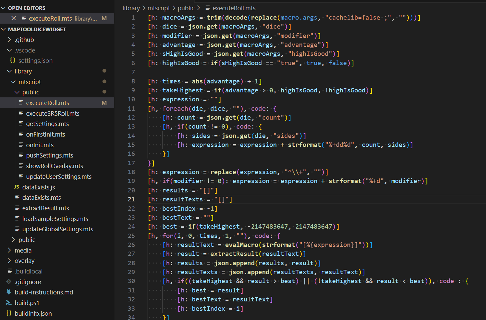
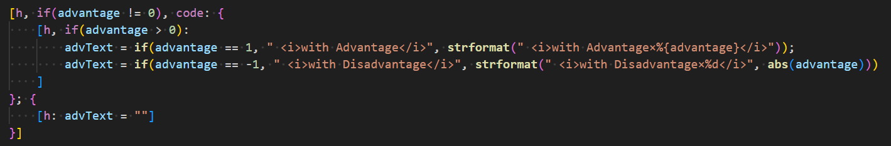

# Maptool VSCode Language Support

Visual Studio Code extension for MapTool macro script language support.

## Features

Basic syntax highlighting for MapTool script.

* Roll Options.
* *Most* nested macros.
* Special variables.
* Separate scopes for built-in vs user-defined fuctions.
  * By default built-in functions are bold, but that can be customized by theme.
* RPEdit formatting support.

## Extension Settings

None yet. :/

## Known Issues

This is very basic. So depending on your coding style it may not catch everything.

## Release Notes

### 0.1.2

* Fixed binary operators breaking quoted strings.

### 0.1.1

* Fixed omission in TextMate grammar causing statements without roll-options to not highlight.

See [Changelog](CHANGELOG.md) for past release notes.

## Roadmap

Planned features

* Improved Syntax Highlighting
  * Operator highlighting
  * Better multi-line macro support
* Semantic Highlighting
* MTScript Language Server
  * Better nested scope handling
  * Hover-text of built-in functions
  * Recognizing variables
  * Tracking UDFs
  * FoldingRangeProvider
